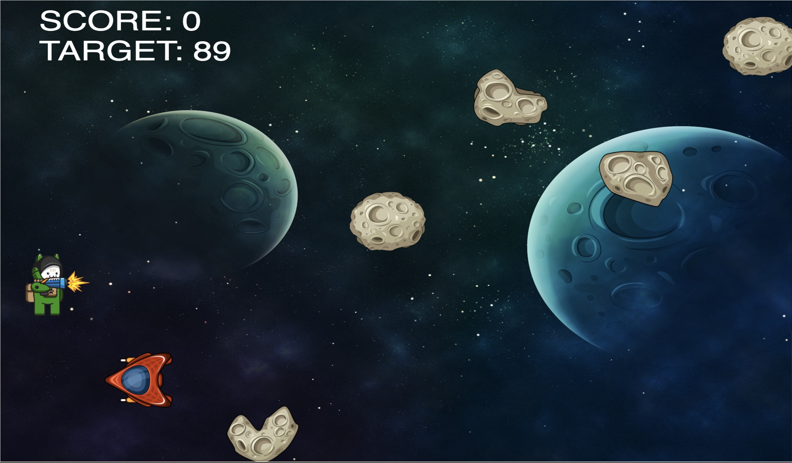

# GATOCALIPSE

In a post-apocalyptic future, cats have taken over the earth! Now, they chase what's left of humanity through outer space. Go, cats! 🪐 🌎 😾

## Let's get started

-----> Click [HERE](https://gilgameshr3rr.github.io/gatocalipse/index.html) to play <-----.

## How to Play

Refresh the page to start.  ⌛

Use the keyboard’s arrows (↑ ↓ → ←) to move your Cat. 😾

To win this game you have to reach a random number of points, each starship destroyed will give you 10 points. 😻 🚀 

Watch out for obstacles!  😿 🪨  💫 🚀

## Built With

Gatocalipse is a game built in:

-   HTML, CSS, canvas and JavaScript.
-   Cat from  [https://bevouliin.com/](https://bevouliin.com/)  
-   Icons from  [https://assetstore.unity.com/](https://assetstore.unity.com/)

## Future improvements

-   Improve collision detection
-   Game restart without refresh
-   Different scores for different obstacles
-   Improve game design
-   Move assets to separate folder
